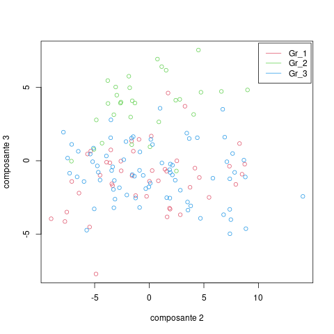
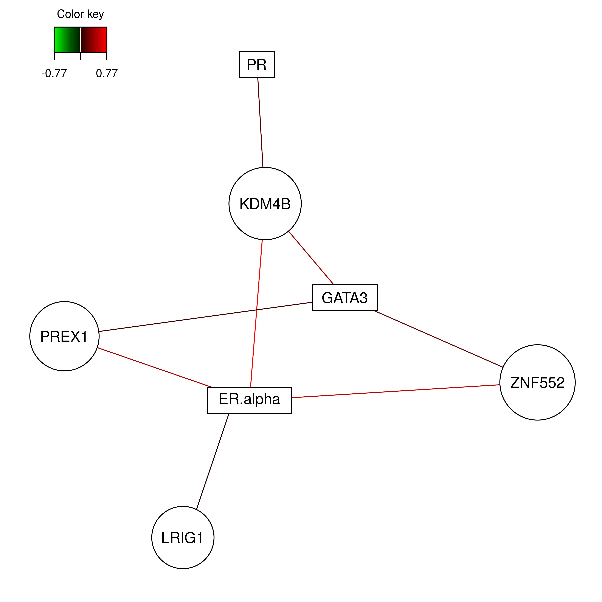
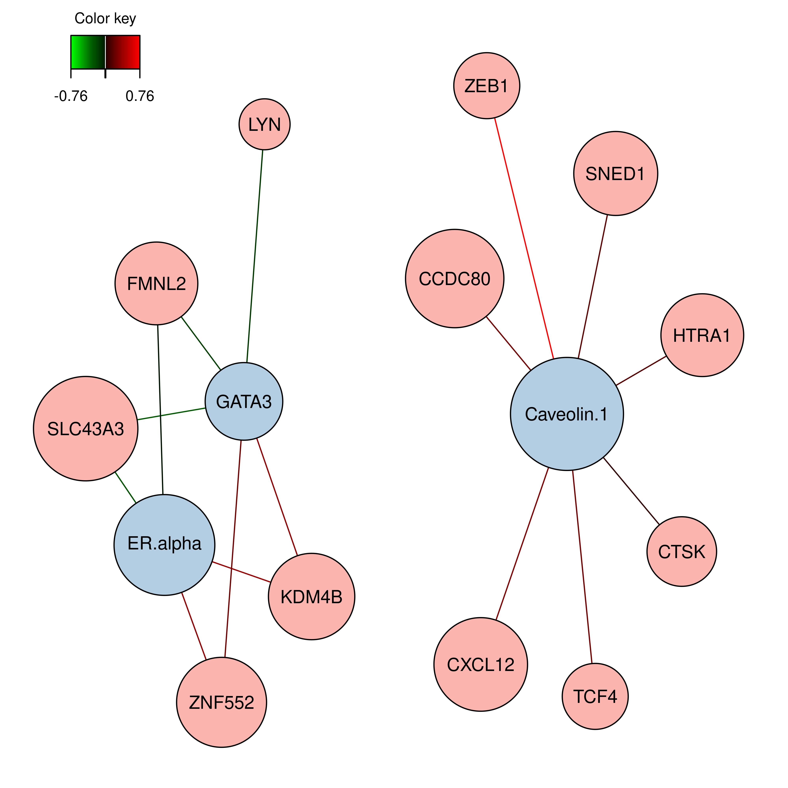

<style>
body {
text-align: justify}
</style>

```{r setup, include=FALSE}
knitr::opts_chunk$set(echo = FALSE, include=TRUE, cache=TRUE, fig.align="center", fig.show="asis", fig.pos="H")
```

```{r library_installation, message=FALSE, warning=FALSE, eval=F}
#install.packages("tidyverse")

if (!requireNamespace("BiocManager", quietly = TRUE))
    install.packages("BiocManager")
BiocManager::install("mixOmics")
#BiocManager::install("timeOmics")
```

```{r library_load, message=FALSE, warning=FALSE}
library("MASS")
#library("tidyverse")
library("mixOmics")
#library("timeOmics")
```

https://adcloud.compbio.ulaval.ca/index.php/s/SdDrKrkbq9QHCLn


# Partie 1

```{r}
mirna = read.csv("ParisDiderot_202010/mirna.csv", header = T)
row.names(mirna) = mirna[,1]
mirna = mirna[,-1]
#dim(mirna)

mrna = read.csv("ParisDiderot_202010/mrna.csv", header = T)
row.names(mrna) = mrna[,1]
mrna = mrna[,-1]
#dim(mrna)

prot = read.csv("ParisDiderot_202010/protein.csv", header = T)
row.names(prot) = prot[,1]
prot = prot[,-1]
#dim(prot)

sample = read.csv("ParisDiderot_202010/sample_group.csv", header = T)
#dim(sample)
```

Pour les protéines, miRNA et gènes, on possède les données de 150 échantillons. On a ensuite 142 variables pour les protéines, 184 pour les miRNA et 200 pour les gènes.

## Analyse variation
```{r}
coeff_variation = function(vec){
  return(sd(vec) / mean(vec))
}
truehist(apply(mirna, 2, coeff_variation), xlab = "Distribution du coeffcicient de variation - mirna")
truehist(apply(mrna, 2, coeff_variation), xlab = "Distribution du coeffcicient de variation - mrna")
truehist(apply(prot, 2, coeff_variation), xlab = "Distribution du coeffcicient de variation - proteine")
```

On peut voir sur les histogrammes que le type de données possédant le plus de variabilité est le type protéine. En effet, sa variabilité est comprise entre -100 et 250, même si on peut observer qu'elle est comme les autres centrée vers 0.

## Nettoyage des données
```{r}
mirna.c = mirna[,which(abs(apply(mirna, 2, coeff_variation)) >= 0.15)]
#dim(mirna)
#dim(mirna.c)

mrna.c = mrna[,which(abs(apply(mrna, 2, coeff_variation)) >= 0.15)]
#dim(mrna)
#dim(mrna.c)

prot.c = prot[,which(abs(apply(prot, 2, coeff_variation)) >= 0.15)]
#dim(prot)
#dim(prot.c)
```

Il nous reste 142 protéines, 174 gènes et 82 miRNA.

## Gène le plus variable

Le gène avec le plus grand coefficient de variance de notre jeu de données est PLCD4. La protéine codée par ce gène peut jouer un rôle dans la croissance et la prolifération cellulaire. Son expression peut donc notamment être un marqueur de cancer. 
PLCD4 est situé sur le chromosome 2, et sa longueur est de 30749 nucléotides.
La protéine correspondant à ce gène est Q9BRC7, d'une longueur de 762 nucléotides, mais n'est pas contenue dans notre jeu de données.

# Partie 2

## 1. Single-omic: l’ACP avec mixOmics
```{r}
mrna.pca = tune.pca(X = mrna.c, ncomp = 50, center = F, scale = F)
```
Au vu de l'histogramme:
  
  - Une seule composante explique la majorité de la variabilité.
  - Il peut être intéressant de centrer-réduire les données pour mieux dégager la variabilité des données.

```{r}
mrna.pca = tune.pca(X = mrna.c, ncomp = 50, center = T, scale = T)
mrna.pca$cum.var
```

Les 30 premières composantes expliquent 80% de la variabilité et elles sont donc sélectionnées.

```{r}
mrna.pca = pca(X = mrna.c, ncomp = 30, center = T, scale = T)
plotVar(mrna.pca, comp = c(1,2), var.names = T)
#plotVar(mrna.pca, comp = c(1,3), var.names = T)
var1pca = selectVar(mrna.pca, comp = 1)$value
name.var1pca = row.names(var1pca)[0:10]
```

Les dix variables contribuant le plus à l'axe 1 sont : `r name.var1pca`. Les graphiques représentant les variables sont actuellement très difficilement lisibles, on doit donc afficher les contributions des variables aux composantes à l'aide d'une commande.

```{r}
vec_col = as.numeric(as.factor(sample$Y))
plotIndiv(mrna.pca, group = vec_col, legend = T, title = "Individus selon composantes 1-2 pca")
```

On peut observer que la PCA sépare de façon assez distincte les individus des trois groupes selon les 2 premières composantes, malgré des frontières assez floues entre les groupes.

```{r}
spca.mrna = spca(mrna.c, ncomp = 3, center = TRUE, scale = TRUE,
                    keepX = c(10, 5, 15))
var1spca = selectVar(spca.mrna, comp = 1)$value
name.var1spca = row.names(var1spca)
var2spca = selectVar(spca.mrna, comp = 2)$value
name.var2spca = row.names(var2spca)
```

Les gènes sélectionnés par la spca pour la première composante sont : `r name.var1spca`.
Pour la seconde composante principale, on a retenu `r name.var2spca`.

## 2.1 Projection on Latent Structures

```{r}
pls.result = pls(X = mrna.c, Y = prot.c, ncomp = 3)
```

```{r, include=FALSE}

png("img/scatter_plot_pls.png")
plot(pls.result$variates$X[,2],pls.result$variates$X[,3], col = vec_col+1, ylab = "composante 3",xlab = "composante 2", main = "comparaisons des composantes 1 et 2 avec les groupes\n d'echantillons affiches en couleur.")
legend(x = 10, y = 8, legend = names(table(sample$Y)), col = c(2,3,4), lty = 1)
dev.off()

png("img/arrow_plot_pls.png")
plotArrow(pls.result, comp = c(1,3), X.label =  "comp1", Y.label = "comp3",col = vec_col+1, title = "Arrow plot des composantes 1 et 3")
legend(x = 5, y = 9, legend = names(table(sample$Y)), col = c(2,3,4), lty = 1)
dev.off()
dev.off()
```




```{r, include=FALSE}
spls.result = spls(X = mrna.c, Y = prot.c, ncomp = 3, keepX  = c(10,5,1), keepY = c(9,5,1) )

var3spls = c(selectVar(spls.result, comp = 3)$X$name,
             selectVar(spls.result, comp = 3)$Y$name)

png("img/cim_plot_spls.png")
cim(spls.result)
dev.off()
```

Les variables retenues pour la troisième composante sont `r var3spls`.


```{r, include=FALSE}
network(spls.result,cutoff = 0.65, name.save = "img/network_plot_spls", save = "png")
```



Sur la spls, on peut observer 7 clusters différents possédant une corrélation supérieure à 0.65 ou inférieure à -0.65 (3 protéines et 4 gènes).

## 2.2 Multiblock Projection on Latent Structures

```{r}
x.data = list(mrna = mrna.c, prot = prot.c)
y.data = as.matrix(as.data.frame(mirna.c))
```

```{r}
omics.block.pls = block.pls(X = x.data, Y = y.data, ncomp = 2)
#omics.block.pls

#selectVar(omics.block.pls, comp = 1)
#selectVar(omics.block.pls, comp = 2)

plotVar(omics.block.pls)
plotLoadings(omics.block.pls)
network(omics.block.pls, cutoff = 0.65, name.save = "img/block-pls", save = "png")
```



```{r}
design = matrix(1, ncol = length(x.data), nrow = length(x.data), 
                dimnames = list(names(x.data), names(data)))
diag(design) = 0
#design

list.keepX = list(mrna = c(10, 5), prot = c(9, 4))
list.keepY = c(7, 3)

omics.block.spls = block.spls(X = x.data, Y = y.data, ncomp = c(2), keepX = list.keepX, keepY = list.keepY, design = design) 

#omics.block.spls

#selectVar(omics.block.spls, comp = 1)
#selectVar(omics.block.spls, comp = 2)

plotVar(omics.block.spls)
plotLoadings(omics.block.spls)
network(omics.block.spls, cutoff = 0.65, name.save = "img/block-spls", save = "png")

mrna.selected = selectVar(omics.block.spls, comp = 1)$mrna$name
prot.selected = selectVar(omics.block.spls, comp = 1)$prot$name
mirna.selected = selectVar(omics.block.spls, comp = 1)$Y$name
```


Les variables sélectionnées sur la première composante sont:

  - Mrna: `r mrna.selected`
  - Protéine: `r prot.selected`
  - Mirna: `r mirna.selected`

## 3. Analyse supervisée : (s)PLS-DA

```{r}
plsda.mrna = plsda(mrna.c, sample$Y, ncomp = 2)
plotIndiv(plsda.mrna, legend = T,
          title = "Individus selon composantes 1-2 PLS-DA")
```

Par rapport à la PCA, on peut considérer que la PLS-DA permet de mieux retrouver nos trois groupes d'échantillons sur ce graphique par rapport aux deux premières composantes principales. En effet, les trois groupes sont ici clairement distincts dans l'espace du graphique, et les frontières entre groupes sont bien plus marquées. Il semblerait donc que la variabilité des données calculée par la PLS-DA permet de mieux expliquer les différences génétiques entre les groupes de nos échantillons.

## 4. Analyse supervisée : block-(s)PLS-DA

```{r}
list.of.all = list(mrna = mrna.c, prot = prot.c, mirna = mirna.c)
block.splsda.all = block.splsda(list.of.all,
                                Y = sample$Y, ncomp = 5)
plotIndiv(block.splsda.all, legend = T)
```

```{r}
perf.splsda = perf(block.splsda.all)
plot(perf.splsda)
```

```{r}
#Block PLS-DA avec keepX
list.keepX = list(mrna = c(15,10), prot = c(15,10), mirna = c(15,10))
block.splsda.keepX = block.splsda(list.of.all,
                                Y = sample$Y, ncomp = 2,
                                keepX = list.keepX)
plotIndiv(block.splsda.keepX, legend = T)
```

```{r}
# Circosplot
circosPlot(block.splsda.keepX, cutoff = 0.5)
title("circos plot proteine mirna et mrna")
```

