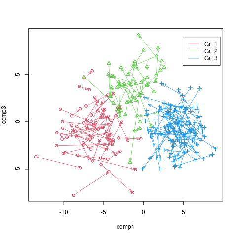
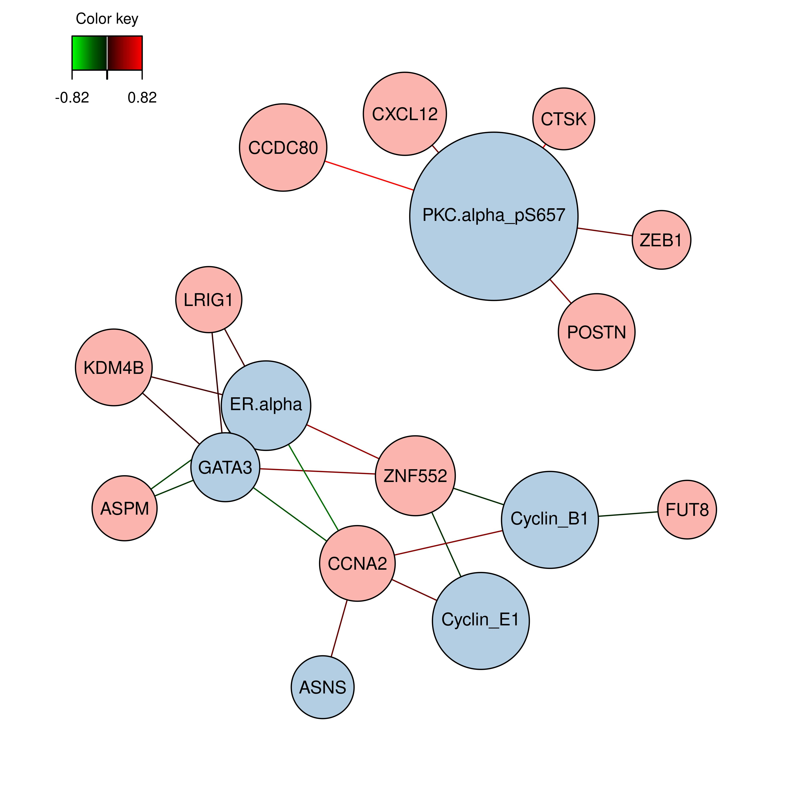

<style>
body {
text-align: justify}
</style>

```{r setup, include=FALSE}
knitr::opts_chunk$set(echo = FALSE, include=FALSE, cache=FALSE, fig.align="center", fig.show="asis", fig.pos="H")
```

```{r library_installation, eval=F, message=FALSE, warning=FALSE}
#install.packages("tidyverse")

#if (!requireNamespace("BiocManager", quietly = TRUE))
#    install.packages("BiocManager")
#BiocManager::install("mixOmics")
#BiocManager::install("timeOmics")
```

```{r library_load, message=FALSE, warning=FALSE}
#library("tidyverse")
library("mixOmics")
#library("timeOmics")
```

https://adcloud.compbio.ulaval.ca/index.php/s/SdDrKrkbq9QHCLn


# Partie I

```{r}
mirna = read.csv("ParisDiderot_202010/mirna.csv", header = T)
row.names(mirna) = mirna[,1]
mirna = mirna[,-1]
dim(mirna)

mrna = read.csv("ParisDiderot_202010/mrna.csv", header = T)
row.names(mrna) = mrna[,1]
mrna = mrna[,-1]
dim(mrna)

prot = read.csv("ParisDiderot_202010/protein.csv", header = T)
row.names(prot) = prot[,1]
prot = prot[,-1]
dim(prot)

sample = read.csv("ParisDiderot_202010/sample_group.csv", header = T)
dim(sample)
```

Pour les protéines, miRNA et gènes, on possède les données de 150 échantillons. On a ensuite 142 variables pour les protéines, 184 pour les miRNA et 200 pour les gènes.

## Analyse variation
```{r}
coeff_variation = function(vec){
  return(sd(vec) / mean(vec))
}
```


```{r, include=T, out.width="80%", out.height="80%", fig.cap="Distribution du coefficient de variation dans le bloc mirna"}
truehist(apply(mirna, 2, coeff_variation), xlab = "mirna", col="#8b1538")
```

```{r, include=T, out.width="80%", out.height="80%", fig.cap="Distribution du coefficient de variation dans le blocs mrna"}
truehist(apply(mrna, 2, coeff_variation), xlab = "mrna", col="#8b1538")
```

```{r, include=T, out.width="80%", out.height="80%", fig.cap="Distribution du coefficient de variation dans le bloc protéine"}
truehist(apply(prot, 2, coeff_variation), xlab = "Proteine", col="#8b1538")
```

On peut voir sur les histogrammes que le type de données possédant le plus de variabilité est le type protéine. En effet, sa variabilité est comprise entre -100 et 250, même si on peut observer qu'elle est comme les autres centrée vers 0.


## Nettoyage des données
```{r}
mirna.c = mirna[,which(abs(apply(mirna, 2, coeff_variation)) >= 0.15)]
dim(mirna)
dim(mirna.c)

mrna.c = mrna[,which(abs(apply(mrna, 2, coeff_variation)) >= 0.15)]
dim(mrna)
dim(mrna.c)

prot.c = prot[,which(abs(apply(prot, 2, coeff_variation)) >= 0.15)]
dim(prot)
dim(prot.c)
```

En supprimant les données les plus variantes ($\lvert{C_v}\rvert \geq 0.15$), il ne reste que 142 protéines, 174 gènes et 82 miRNA.

## Gène le plus variable

Le gène avec le plus grand coefficient de variance de notre jeu de données est PLCD4. La protéine codée par ce gène peut jouer un rôle dans la croissance et la prolifération cellulaire. Son expression peut donc notamment être un marqueur de cancer. 
PLCD4 est situé sur le chromosome 2, et sa longueur est de 30749 nucléotides.
La protéine correspondant à ce gène est Q9BRC7, d'une longueur de 762 nucléotides, mais n'est pas contenue dans notre jeu de données.

# Partie II

## 1. Single-omic: l’ACP avec mixOmics

L'ACP est une méthode d'analyse statistique et de réduction des données, permettant de calculer des composantes maximisant la variabilité des données étudiées. On peut ensuite évaluer si les composantes calculées permettent de caractériser correctement la variabilité des données (par exemple s'il est possible de retrouver certains groupes séparés distinctement par les composantes), et d'identifier les variables les plus importantes participant à ces composantes.

```{r, include=T, out.width="80%", out.height="80%", fig.cap="Explication de la variabilité par les différentes composantes - avec center & scale false"}
mrna.pca = tune.pca(X = mrna.c, ncomp = 50, center = F, scale = F)
mrna.pca
```
Au vu de l'histogramme:
  
  - Une seule composante explique la majorité de la variabilité.
  - Il peut être intéressant de centrer-réduire les données pour mieux dégager la variabilité des données.

```{r, include=T, out.width="80%", out.height="80%", fig.cap="Explication de la variabilité par les différentes composantes - avec center & scale true"}
mrna.pca = tune.pca(X = mrna.c, ncomp = 50, center = T, scale = T)
```

```{r}
mrna.pca$cum.var
```

Les 30 premières composantes expliquent 80% de la variabilité et elles sont donc sélectionnées.

```{r}
mrna.pca = pca(X = mrna.c, ncomp = 30, center = T, scale = T)
#plotVar(mrna.pca, comp = c(1,3), var.names = T)
var1pca = selectVar(mrna.pca, comp = 1)$value
name.var1pca = row.names(var1pca)[0:10]
```

```{r, include=T, out.width="80%", out.height="80%", fig.cap="Projection des variables (ici les gènes) selon les composantes 1 et 2 d'une ACP"}
plotVar(mrna.pca, comp = c(1,2), var.names = T, col = "#8b1538")
```

Les dix variables contribuant le plus à l'axe 1 sont : `r name.var1pca`. Les graphiques représentant les variables sont actuellement très difficilement lisibles, on doit donc afficher les contributions des variables aux composantes à l'aide d'une commande.

```{r}
vec_col = as.numeric(as.factor(sample$Y))
```

```{r, include=T, out.width="80%", out.height="80%", fig.cap="Projection des individus selon les composantes 1 et 2 d'une ACP"}
plotIndiv(mrna.pca, group = vec_col, legend = T, title = "")
```

On peut observer que la PCA sépare de façon assez distincte les individus des trois groupes selon les 2 premières composantes, malgré des frontières assez floues entre les groupes.

```{r}
spca.mrna = spca(mrna.c, ncomp = 3, center = TRUE, scale = TRUE,
                    keepX = c(10, 5, 15))
var1spca = selectVar(spca.mrna, comp = 1)$value
name.var1spca = row.names(var1spca)
var2spca = selectVar(spca.mrna, comp = 2)$value
name.var2spca = row.names(var2spca)
```

Les gènes sélectionnés par la spca pour la première composante sont : `r name.var1spca`.
Pour la seconde composante principale, on a retenu `r name.var2spca`.

```{r, include=T, out.width="80%", out.height="80%", fig.cap="Projection des gènes principaux selon les composantes 1 et 2 d'une Sparse-PCA"}
plotVar(spca.mrna, comp = c(1,2), var.names = T, col = "#8b1538", cex=3.9)
```

## 2.1 Projection on Latent Structures

La PLS est une méthode statistique permettant de traiter différentes matrices de données. Contrairement à l'ACP, qui ne peut analyser qu'un jeu de données à la fois, on va ici pouvoir dégager des composantes - dites latentes - maximisant la covariance entre nos deux matrices d'entrée. Sur notre analyse, on va ainsi pouvoir dégager via les composantes les possibles corrélations entre l'expression génique et l'expression protéique.

```{r}
pls.result = pls(X = mrna.c, Y = prot.c, ncomp = 3)
```

```{r}
png("img/scatter_plot_pls.png")
plot(pls.result$variates$X[,2],pls.result$variates$X[,3], col = vec_col+1, ylab = "composante 3",xlab = "composante 2", main = "")
legend(x = 10, y = 8, legend = names(table(sample$Y)), col = c(2,3,4), lty = 1)
dev.off()

png("img/arrow_plot_pls.png")
plotArrow(pls.result, comp = c(1,3), X.label =  "comp1", Y.label = "comp3",col = vec_col+1, title = "")
legend(x = 5, y = 9, legend = names(table(sample$Y)), col = c(2,3,4), lty = 1)
dev.off()
```

```{r, include=T, out.width="80%", out.height="80%", fig.cap="Projection des individus colorés en fonction de leur groupe selon les composantes 2 et 3 d'une PLS"}
knitr::include_graphics("img/scatter_plot_pls.png")
```

```{r, include=T, out.width="80%", out.height="80%", fig.cap="Arrow plot des individus colorés en fonction de leur groupe selon les composantes 1 et 3 d'une PLS"}

```

```{r, include=FALSE}
spls.result = spls(X = mrna.c, Y = prot.c, ncomp = 3, keepX  = c(10,5,1), keepY = c(9,5,1) )

var3spls = c(selectVar(spls.result, comp = 3)$X$name,
             selectVar(spls.result, comp = 3)$Y$name)

png("img/cim_plot_spls.png")
cim(spls.result)
dev.off()
```

Les variables retenues pour la troisième composante sont `r var3spls`.

```{r, include=T, out.width="80%", out.height="80%", fig.cap="Matrice de corrélation entre l'expression des gènes et l'expression des protéines calculée à partir d'une Sparse-PLS"}

```


```{r}
network(spls.result,cutoff = 0.65, name.save = "img/network_plot_spls", save = "png")
```

```{r, include=T, fig.cap="Network plot des gènes et protéines les plus corrélés (|p| > 0.65) à partir des résultats d'une SPLS"}
knitr::include_graphics("img/network_plot_spls.png")
```

Sur la spls, on peut observer 7 clusters différents possédant une corrélation supérieure à 0.65 ou inférieure à -0.65 (3 protéines et 4 gènes).


## 2.2 Multiblock Projection on Latent Structures

```{r}
x.data = list(mrna = mrna.c, prot = prot.c)
y.data = as.matrix(as.data.frame(mirna.c))
```

```{r}
omics.block.pls = block.pls(X = x.data, Y = y.data, ncomp = 2)
omics.block.pls

selectVar(omics.block.pls, comp = 1)
selectVar(omics.block.pls, comp = 2)

network(omics.block.pls, cutoff = 0.65, name.save = "img/block-pls", save = "png")
```

```{r, include=T, out.width="80%", out.height="80%", fig.cap="Résultats d'une block pls sur les protéines, mrna et mirna"}
plotVar(omics.block.pls)
plotLoadings(omics.block.pls)
knitr::include_graphics("img/block-pls.png")
```

```{r}
design = matrix(1, ncol = length(x.data), nrow = length(x.data), 
                dimnames = list(names(x.data), names(data)))
diag(design) = 0
design

list.keepX = list(mrna = c(10, 5), prot = c(9, 4))
list.keepY = c(7, 3)

omics.block.spls = block.spls(X = x.data, Y = y.data, ncomp = c(2), keepX = list.keepX, keepY = list.keepY, design = design) 

#omics.block.spls
#selectVar(omics.block.spls, comp = 1)
#selectVar(omics.block.spls, comp = 2)

network(omics.block.spls, cutoff = 0.65, name.save = "img/block-spls", save = "png")

mrna.selected = selectVar(omics.block.spls, comp = 1)$mrna$name
prot.selected = selectVar(omics.block.spls, comp = 1)$prot$name
mirna.selected = selectVar(omics.block.spls, comp = 1)$Y$name
```

```{r, include=T, out.width="80%", out.height="80%", fig.cap="Résultats d'une block spls sur les protéines, mrna et mirna"}
plotVar(omics.block.spls)
plotLoadings(omics.block.spls)

```

Les variables sélectionnées sur la première composante sont:

  - Mrna: `r mrna.selected`
  - Protéine: `r prot.selected`
  - Mirna: `r mirna.selected`

## 3. Analyse supervisée : (s)PLS-DA

```{r}
plsda.mrna = plsda(mrna.c, sample$Y, ncomp = 2)
```

```{r, include=T, out.width="80%", out.height="80%", fig.cap="Projection des individus selon les composantes 1 et 2 d'une PLS-DA"}
plotIndiv(plsda.mrna, legend = T, title = "")
```

Par rapport à la PCA, on peut considérer que la PLS-DA permet de mieux retrouver nos trois groupes d'échantillons sur ce graphique par rapport aux deux premières composantes principales. En effet, les trois groupes sont ici clairement distincts dans l'espace du graphique, et les frontières entre groupes sont bien plus marquées. Il semblerait donc que la variabilité des données calculée par la PLS-DA permet de mieux expliquer les différences génétiques entre les groupes de nos échantillons.

## 4. Analyse supervisée : block-(s)PLS-DA

```{r}
list.of.all = list(mrna = mrna.c, prot = prot.c, mirna = mirna.c)
block.splsda.all = block.splsda(list.of.all,
                                Y = sample$Y, ncomp = 5)
```

```{r, include=T, out.width="80%", out.height="80%", fig.cap="Projection des individus selon les composantes 1 et 2 d'une block spls-da réalisée sur les gènes, mirna et protéines"}
plotIndiv(block.splsda.all, legend = T)
```

```{r}
perf.splsda = perf(block.splsda.all)
plot(perf.splsda)
```

```{r}
#Block PLS-DA avec keepX
list.keepX = list(mrna = c(15,10), prot = c(15,10), mirna = c(15,10))
block.splsda.keepX = block.splsda(list.of.all,
                                Y = sample$Y, ncomp = 2,
                                keepX = list.keepX)
```

```{r, include=T, out.width="80%", out.height="80%", fig.cap="Projection des individus selon les composantes 1 et 2 d'une block spls-da réalisée sur les gènes, mirna et protéines après sélection d'un nombre limité de variables pour chaque jeu de données"}
plotIndiv(block.splsda.keepX, legend = T)
```

```{r, include=T, out.width="100%", out.height="100%", fig.cap="Circosplot des protéines, mirna et mrna avec un cutoff de 0.5"}
# Circosplot
circosPlot(block.splsda.keepX, cutoff = 0.5)
```

# Partie III

## Question 1

Nous travaillons ici sur les effets de l'exposition à des polluants sur la santé des ours polaires. On a accès pour une vingtaine de trios (une mère et sa portée de deux enfants) à deux types de données omiques:

- des données transcriptomiques
- Diverses mesures cliniques numériques - on va supposer que ces données sont par exemple le poids, la taille...
- On va également admettre que l'on a accès au taux d'exposition aux polluants pour chaque ours polaire.

On choisit de considérer le taux d'exposition au polluant comme une donnée qualitative à trois niveaux, pour diviser nos données sur les ours polaires en trois groupes :

- Ours faiblement exposé
- Ours moyennement exposé
- Ours fortement exposé


> Projection on Latent Structures (PLS)

La PLS va nous permettre de dégager via les composantes latentes calculées les possibles corrélations entre les ARN messagers et les mesures cliniques.

```
pls.result = pls(X = mrna, Y = clinical_data)
```

avec:

- rna: matrice des données transcriptomiques
- data: matrice mesures cliniques

Cette approche peut nous permettre dans un premier temps d'évaluer la covariance entre nos deux types de données, et d'observer si, sans connaître les groupes de sortie, on peut tout de même retrouver les groupes exposés à de plus ou moins forts taux de pollution.
Il est possible pour savoir si ces groupes sont retrouvés de représenter nos individus sur un graphe selon les deux premières composantes calculées par la pls par exemple, et de colorer les individus selon les groupes choisis.

> PLS-Discriminant Analysis (PLS-DA)

Étant donné que l'on a choisi de représenter l'exposition au polluant de manière qualitative, il est possible de réaliser une analyse supervisée de nos données via une pls-da pour observer la covariance des données disponibles expliquant au mieux la répartition des trois groupes choisis.

On a donc,
```
plsda.result = plsda(matrix, Y, ncomp = 2)
```

avec:

- matrix: matrice des données transcriptomiques, poids et taille
- Y: variable qualitative taux d'exposition à 3 classes - faible, moyen & élevé - transformée en vecteur one-hot


transcriptomique
Groupe témoin échantillon sans pollution ?
traiter différemment la mère et les enfants
attention variations entre famille
évaluer la variance de nos échantillons
exposition mère impacte enfants ?

analyse en heatmap (spls, cim -> non, que transcriptome)
P.heatmap
acp ? variables
repérer les points communément sur ou sous exprimés


## Question 2

> Approche simple omique

Nous travaillons ici sur des microbiotes de souris ayant subi ou non un traitement. On a accès pour chaque souris à deux types de données omiques : métagénomiques (données 16S du microbiote) et métabolomiques (décompte de molécules du métabolome).

Il peut être intéressant dans ce cas d'effectuer une première approche simple omique, par exemple sur nos données de métagénomique. En effet, sur chacun des deux groupes (traité et non-traité), certaines métriques peuvent être analysés via nos données 16S. On peut ici admettre que l'on a à notre disposition une table d'OTU. À partir de cette table il est possible de calculer les diversité alpha, bêta, ainsi que les tables d'abondance de nos deux échantillons. On peut alors comparer ces résultats pour observer si le microbiote intestinal a été impacté par le traitement et dans quelle mesure.
Cependant nous possédons également des données métabolomiques. En approche simple omique, nous pouvons déterminer quels sont les molécules présentes selon une même intensité, et si l'on observe des différences de comptage significative au contact du traitement.

> Approche multiomique

Cependant, au vu des outils disponibles, il apparaît nécessaire et très informatif d'effectuer également une analyse multiomique. Les différentes informations apportées par les analyses simple-omiques nous permettent de mettre en lumière les différences entre les groupes de souris, mais il pourrait être intéressant dans un second temps d'évaluer la covariance de ces données.
En effet, les données métagénomiques nous permettent de connaître la composition du microbiote des souris en termes de micro-organisme, et les données métabolomiques donnent une analyse sur la composition des molécules métaboliques du milieu intestinal probablement.
Pour déterminer plus précisément les impacts du traitement sur le milieu intestinal, il est donc nécessaire d'utiliser l'outil de "Projection on Latent Structure". On va ainsi pouvoir trouver les composantes maximisant la covariance entre métagénomique et métabolomique. On peut ainsi effectuer une sparse PLS sur les souris traitées d'un côté et non traitées de l'autre.
Un cim plot pourra ainsi être utilisé pour visualiser la variance entre nos différentes variables, ainsi qu'un network plot pour représenter les 16S et les métabolites les plus corrélés.
Ces deux représentations graphiques peuvent être utilisées pour les souris traitées et non traitées, pour ensuite comparer nos deux résultats, et ainsi évaluer si le traitement a une influence sur la covariance entre les données omiques.


